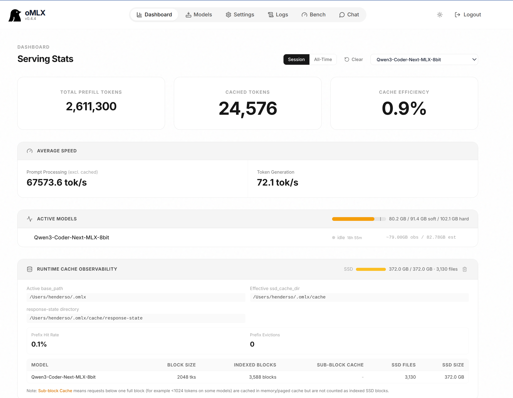

A lot of the work I do lives in a place cloud LLMs can't go. Incident writeups, reverse engineering, artifact analysis, internal vuln-triage notes — the threat-intel workflows that would benefit *most* from an AI assistant are exactly the ones where pasting text into somebody else's API is a no-go. Most LLM benchmarking quietly ignores this, because the benchmarks assume you can just call GPT. In my world you often can't.

So the question I actually wondered about: **how much real CTI capability can I get out of a model running entirely on hardware I own** — no cloud, no API key, nothing leaving the room, 100% airgap? To find out, I took the 8bit quantized version of [Qwen3-Coder-Next](https://huggingface.co/Qwen/Qwen3-Coder-Next),  served it locally with oMLX, and pointed the full 8,100-prompt AthenaBench threat-intelligence benchmark at it. Short version: it lands between Llama 3.3-70B and GPT-4 overall, and beats GPT-4 outright on two of the six tasks. From a laptop.

## The dataset: AthenaBench

[AthenaBench](https://arxiv.org/abs/2511.01144) (WAITI Workshop 2025) is a [benchmark](https://github.com/Athena-Software-Group/athenabench) of six CTI tasks, and what I like about it is how cleanly they map onto the actual day-to-day of a SOC or threat-intel team:

| Task | n | What the model must do | Metric |
| --- | --- | --- | --- |
| **CKT** — CTI Knowledge Test | 3,000 | Five-option multiple choice on [ATT&CK](https://attack.mitre.org/), threat actors, and CTI concepts | Accuracy |
| **ATE** — ATT&CK Technique Extraction | 500 | Read an attack scenario, name the single best-matching technique ID (T####) | Accuracy |
| **RCM** — Root Cause Mapping | 2,000 | Read a [CVE](https://www.cve.org/) description, identify the root-cause [CWE](https://cwe.mitre.org/) | Accuracy |
| **RMS** — Recommended Mitigations | 500 | Recommend exactly four [ATT&CK mitigation IDs](https://attack.mitre.org/mitigations/) (M10xx) for a scenario | F1 |
| **VSP** — Vulnerability Severity Prediction | 2,000 | Derive a full [CVSS v3.1](https://www.first.org/cvss/v3-1/) base vector from a CVE description | 1 − MAD/7.7 |
| **TAA** — Threat Actor Attribution | 100 | Attribute an anonymized incident summary to a known threat actor | Accuracy (with alias/related-actor credit) |

Two things sold me on it as a fair test. First, answers are pulled out of free-form responses and scored mechanically — exact IDs, CVSS score deviation, alias-aware actor matching — so there's no LLM-self-judge or hand-waving. Second, the tasks span a real capability gradient: from pure recall (CKT), through classification (ATE, RCM, VSP), to open-ended generation (RMS) and inference under anonymization (TAA). These dimensions turn out to be exactly the axis along which local models live or die.

## My setup

- **Model:** Qwen3-Coder-Next, 8-bit MLX quantization, exposed on my LAN through an OpenAI-compatible server. Although this is a *coding* model, I genuinely wanted to know how far a structured-output pedigree carries in a domain that's nothing but IDs, vectors, and taxonomies.  If I have to bring one model into an environment, particularly a secure environment where things are burnt to BlueRay and take effort to scan, I'd like to bring just one.  A Swiss Army Knife of sorts.
- **Hardware:** a single 14-inch MacBook Pro — M5 Max (18-core CPU, 40-core GPU, 16-core Neural Engine), **128GB unified memory**, 4TB SSD — serving the model through the exceptional [omlx](https://github.com/jundot/omlx) inference server which optimizes Apple's on-device ML runtime. That memory number is the whole ballgame: an 8-bit quant of a model this size has to sit resident in RAM, and Apple's unified-memory architecture lets the GPU address all 128GB directly. This isn't a rack in a datacenter. It's a laptop you could close and drop in a bag.
- **Generation settings:** temperature 0.0, `max_tokens` 4096.
- **Scoring:** the benchmark's own evaluator, untouched.


*oMLX serving the benchmarked model on the laptop — ~72 tok/s generation, cache and memory all local. The entire 8,100-prompt run lived behind this dashboard.*

That token cap was a key lesson learned. I first ran uncapped, to match how the benchmark's authors ran the OpenAI API models. On the CVSS task the model would occasionally spiral into a runaway generation — one response hit ~78,000 characters of circular analysis before it finally committed to a vector — and latency blew up right along with it. So I added the 4096-token cap (same spirit as the harness's own 2048-token cap for HuggingFace models) and, to keep things honest, regenerated the VSP records that had been produced uncapped. Full run — all 8,100 prompts — *took a bit over a day on that one laptop*.

## Results

Here's the full run, sitting next to previously published benchmark values:

| Model | CKT | ATE | RCM | RMS (F1) | VSP | TAA | Combined |
| --- | --- | --- | --- | --- | --- | --- | --- |
| GPT-5 | 92.0 | 76.0 | 71.6 | 32.6 | 85.4 | 39.0 | 66.1 |
| GPT-4o | 85.2 | 51.6 | 71.3 | 20.2 | 84.7 | 35.0 | 58.0 |
| GPT-4 | 78.7 | 35.8 | 63.1 | 15.1 | 84.7 | 31.0 | 51.4 |
| **Qwen3-Coder-Next (MLX 8-bit, local)** | **82.5** | **42.8** | **62.4** | **8.0** | **80.2** | **18.0** | **49.0** |
| Llama 3.3-70B | 81.4 | 30.4 | 60.0 | 11.1 | 70.1 | 26.0 | 46.5 |
| Qwen3-14B | 78.6 | 19.4 | 54.1 | 7.0 | 80.3 | 17.0 | 42.7 |

A home-served 8-bit model posts the strongest open-weights row on the board: ahead of GPT-4 on threat-intel knowledge (CKT, +3.8) and technique extraction (ATE, +7.0), essentially tied on CVE root-cause mapping, and within five points on CVSS severity. What keeps it from closing the last gap to GPT-4's combined score is the two *generative* tasks — mitigation recommendations and actor attribution.

## What this actually means for security work

**The classification half of CTI work is now viable on-prem.** Technique tagging, CVE-to-CWE mapping, severity triage, knowledge lookup — the model does all of this at roughly GPT-4 level, with the data never leaving the laptop, let alone the building. For anyone handling restricted-distribution intel, that quietly rewrites the calculus: these are precisely the high-volume, low-judgment tasks you'd want to automate first, and they no longer come with a cloud dependency attached.

**Attribution is a neighborhood, not an address.** The headline TAA number (18% exact) looks grim until you read the secondary metric: **96% of the model's attributions were *plausible*** — a correct alias, or an actor documented as related to the true one. It reliably lands in the right cluster of activity and rarely names something outright wrong. As a triage hint — "this tradecraft looks Lazarus-adjacent" — that's genuinely useful. As an attribution *source*, it would be malpractice. Which, to be fair, is true of any unassisted LLM doing attribution.

**Don't let a local model write your mitigation guidance.** RMS (F1 8.0) was the worst task by a mile, and the failure mode is the interesting part: the model can reason perfectly sensibly about defenses in free text, then whiff on the *specific* mitigation IDs that map to the scenario. Every model in the table craters here relative to its other scores — GPT-5 manages only 32.6 — so this is a frontier-wide weakness, not a small-model one. It's just most acute at the small end. ***Prevention and hardening recommendations still need a human, or at the very least heavy retrieval augmentation.***

**The real operational gap is format discipline, not knowledge.** This is the finding I keep coming back to. The most instructive failures weren't the model *not knowing* — they were the model failing to hand me the answer in a shape I could parse. Beyond the runaway generation, 17% of its CVSS responses contained no usable vector at all (the official scorer drops these from the deviation metric, so read the VSP number with that in mind). The model frequently *knows* and simply won't say it cleanly. In production you'd wrap it in structured-output constraints — JSON-schema enforcement, grammar-constrained decoding — and almost certainly buy back several points for free. That's cheap engineering, and it's worth doing before you conclude a local model "can't" do a task. Mostly it can; it just needs someone to hold the output to a format.

## Caveats

This is one run at temperature 0, on an 8-bit quantization (full precision may shift things at the margins), with a 4096-token generation cap where the published API baselines ran uncapped. And a benchmark is always a proxy — AthenaBench's tasks are well-shaped *imitations* of CTI work, not the work itself. I'd treat these numbers as a strong directional signal, not gospel.

## Reproducing

It's all in the AthenaBench harness. My scored outputs and the README table rows are in [my upstream PR](https://github.com/Athena-Software-Group/athenabench/pull/4). To point it at your own local model:

```bash
# config.yaml
my-local-model:
  type: openai
  name: <model id from /v1/models>
  base_url: https://<your-server>/v1
  max_tokens: 4096

python -m athena_eval.run --mini --model my-local-model   # quick pass (950 prompts)
python -m athena_eval.run --model my-local-model          # full benchmark (8,100 prompts)
python -m athena_eval.evaluate --model my-local-model     # official scoring
```

Start with `--mini` — it predicted my full-run results within a point or two on most tasks.

## The Road Ahead

**More models — does the coding-pedigree transfer hold?** The most surprising result here was that a *coding* model held its own on threat-intel knowledge, so the obvious next step is to see whether that generalizes. First up is [Qwen3.6-27B](https://huggingface.co/Qwen/Qwen3.6-27B) — a dense 27B instruct model from the same family, another coding/reasoning flagship, and small enough at 8-bit to sit comfortably in the same 128GB. It runs in "thinking mode" by default, which makes it a natural test of a question this run left open: do explicit reasoning traces *help* the inference-heavy tasks (RCM, VSP), or do they just feed the runaway-generation problem I had to cap? (I also looked hard at [Qwen-AgentWorld-35B-A3B](https://huggingface.co/Qwen/Qwen-AgentWorld-35B-A3B), but it's a base *world-model* built to simulate multi-turn agent environments, not answer single-turn questions — the wrong instrument for AthenaBench's mechanically-scored QA, so it's off the list for now.)

**Retrieval-augmented generation for the weak dimensions.** The two tasks that dragged the combined score down — mitigation recommendations (RMS, F1 8.0) and actor attribution (TAA) — fail for the same underlying reason: the model isn't reasoning badly, it's failing to name the *exact* ID or actor from a large, fixed universe. That's the textbook case for retrieval. And critically, the whole thing stays airgapped, because the knowledge it's missing is *public*. Here's how I'd architect it:

1. **Corpus — bake the references onto the box.** Two bodies of knowledge, both assembled offline. For the *mitigation* task, the static taxonomies: the full [ATT&CK](https://attack.mitre.org/) knowledge base (techniques and mitigations) as STIX, the [CWE](https://cwe.mitre.org/) catalog, and the CVSS specification. For *attribution*, a threat-actor profile corpus stitched together from the CTI sources analysts already live in — [ATT&CK Groups](https://attack.mitre.org/groups/), [CISA advisories](https://www.cisa.gov/news-events/cybersecurity-advisories) (the AA-series actor writeups are dense with TTPs and aliases, which is exactly what the alias-aware TAA metric rewards), [AlienVault OTX](https://otx.alienvault.com/) pulses, and the community actor encyclopedias ([MISP galaxy](https://www.misp-project.org/galaxy.html), [Malpedia](https://malpedia.caad.fkie.fraunhofer.de/)). The taxonomies are essentially static; the actor intel isn't — so it gets pulled as a periodic snapshot and carried across the airgap the same way signatures and feeds already are. All public, no airgap violation — just a refresh cadence.
2. **Index — embed locally.** Chunk and embed the corpus with a local embedding model served through omlx right alongside the LLM, and store the vectors in a local index (FAISS/LanceDB). Nothing leaves the laptop.
3. **Retrieve + rerank.** At query time, embed the scenario, pull the top-*k* candidate mitigations (or actor profiles), and run a small cross-encoder rerank to tighten precision — which matters a lot for RMS, where the metric rewards getting *exactly four* IDs right.
4. **Constrained generation.** Inject those candidates into the prompt and constrain decoding to the valid ID space (M10xx, known actor names) with grammar- or JSON-schema-enforced output. This is the piece I'm most optimistic about, because it attacks *both* failure modes at once: the model gets the right candidates in front of it (knowledge) and can only emit well-formed IDs (the format-discipline gap from the last section).
5. **Wire it in without touching the scorer.** The cleanest integration is a thin retrieval proxy sitting between the AthenaBench harness and the omlx endpoint — it intercepts the prompt, runs the retrieval, injects the context, and forwards on. Same spirit as the `base_url` swap earlier: the benchmark's scoring code never knows the difference, so the comparison stays honest.

The hypothesis is straightforward: RMS is a recall-and-format problem and RAG plus constrained decoding turns "generate the right four IDs from memory" into "select the right four from a shortlist." TAA is even more promising — the model already lands in the right neighborhood 96% of the time, and retrieval over actor TTP profiles is exactly the nudge that could convert those *plausible* hits into *exact* ones. If the real bottleneck turns out to be selection judgment rather than recall, RAG will help less — but I'll measure it on the same harness and let the numbers say so.

If you're sitting on intel you can't ship to a cloud, that's the real headline here: the classification half of the job is already yours to run in-house, today, on hardware you can carry. Give it a run and see for yourself.
