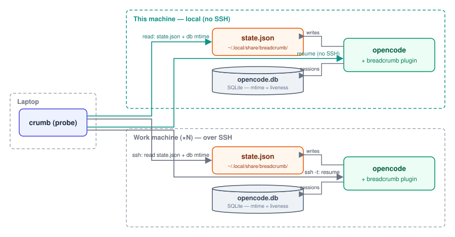

I run [opencode](https://opencode.ai) on a lot of machines: my laptop, a persistent devbox, a build server, a GPU box for evals. That's the natural shape of agentic coding work — some sessions are quick local edits, others are long-running debugging or evaluation runs I deliberately leave on a server. But opencode sessions are **local by design**. A session belongs to the machine and directory where it was born, and its useful context is split across two places: the saved conversation, and the working tree around it.

That split is fine until work moves between machines. Then the questions start piling up:

- Which machine has the session I was working on?
- Was it in `~/src/api` or `~/src/platform`?
- What branch was checked out — and did I leave uncommitted changes?
- What was I even trying to do when I stopped?

I got tired of answering those questions by hunting through terminals and SSH sessions, so I built [**Breadcrumb**](https://github.com/stevehenderson/opencode-breadcrumb): a small tool that remembers where every opencode session lives, what state its workspace was in, and a short gist of the last prompt — then safely drops me back into it.

```console
$ crumb
  1) laptop    2m  fix-auth-refresh*  ~/dev/app       Refactor auth  » extract token refresh
  2) build-01 18m  main               ~/src/platform  Ingress triage  » investigate staging 502
  3) gpu-2     1h  train-run-7        ~/ml/evals      Eval sweep      » run the 7B evaluation
  4) laptop    3h  no-branch          ~/tmp/scratch   (untitled)
select [1-4] (empty cancels): 2

resuming ses_9x82ndk3 on build-01 — /home/dev/src/platform
```

One command, every machine, and I'm back in the session. The `*` means the tree was dirty at last observation; the `»` text is a compact, searchable gist of my last prompt — not a transcript.

## The key insight: the conversation is only half the context

A saved opencode conversation tells you what was *said*. It doesn't tell you what it *means* without the other half: the branch, the commit, the directory, and whether the tree was dirty. A session titled "fix auth refresh" means something very different on a clean `main` than on a dirty `fix-auth-refresh` branch with three uncommitted files.

Breadcrumb captures both halves — and then, critically, **refuses to manage your Git state for you**. It observes and reports; it never checks out, stashes, or cleans anything. Your branch and working tree remain yours.

## The architecture: two components, zero daemons

I wanted something I could install on a machine without changing how opencode works, and remove without leaving a resident process behind. So Breadcrumb is intentionally tiny:



**1. An in-process plugin** (`plugin/breadcrumb.ts`) runs inside opencode on each enrolled machine. It listens to session lifecycle and message events, captures session metadata plus Git state, and atomically rewrites one small JSON snapshot at `~/.local/share/breadcrumb/state.json` (temp file + `fsync` + rename, so a read never catches a half-written file). It only runs while opencode runs — no socket, no daemon, no touching opencode's database. Each machine keeps at most 200 recent snapshots, so state stays bounded.

**2. A laptop-side probe** (`probe/crumb.ts`) is the `crumb` CLI. It reads the local snapshot directly and remote snapshots through the system `ssh` — concurrently, with per-host connect timeouts and an overall deadline, so one offline box doesn't block the list. It merges everything newest-first and offers an `fzf` picker (or a numbered fallback).

The contract between them is a single typed schema in `shared/state.ts`. No queue, no broker, no database migration, no sync protocol. When you pick a session, the probe resumes it on its *origin* machine over `ssh -t` — wrapped in a named `tmux` session when available, so a dropped connection detaches instead of killing your work.

## Safe resume: trust, but verify

Before launching `opencode -s <session_id>`, Breadcrumb re-checks the remote directory and Git state. If the workspace has drifted since the snapshot — branch moved, new dirty files — it shows you the difference and asks before continuing. It restores the *conversation*, not your filesystem.

That boundary is deliberate. Breadcrumb is explicitly **not**:

- a replacement for opencode's session storage;
- a shell-history or Git-event recorder;
- a multi-user collaboration service;
- a system that migrates a session to a different machine; or
- an automatic Git cleanup, checkout, or stash tool.

Freshness follows the pull model: the list is as current as the last time you ran `crumb`. That avoids polling and keeps work machines free of yet another resident service.

## A small, security-conscious footprint

Given my day job, I couldn't bring myself to ship a tool that punches holes in my own machines. So: **SSH is the only inter-machine channel** — no new listeners, no network service, and your existing `~/.ssh/config` handles ports, identities, and jump hosts. State files are owner-only and contain metadata, not full transcripts. State-derived values are shell-quoted before they ever appear in a remote command, and unknown schema versions are rejected rather than guessed at.

## Using it

Requirements are minimal: opencode on each machine, Node.js ≥ 23.6 or Bun for the probe, `ssh` and `git`, plus optional `fzf` and `tmux` for the nicer picker and detach-on-drop resume.

```sh
git clone https://github.com/stevehenderson/opencode-breadcrumb
cd opencode-breadcrumb
npm install && npm link      # puts `crumb` on your PATH

crumb install                # enroll this machine (copies the plugin in)
crumb hosts add build-01 gpu-2   # one SSH target per line
crumb                        # browse everything
```

From there it's `crumb` to browse, `crumb search ingress 502` to filter across machine, title, branch, path, or prompt gist, and `crumb health` for reachability and freshness at a glance. The full command reference lives in [`docs/commands.md`](https://github.com/stevehenderson/opencode-breadcrumb/blob/main/docs/commands.md), and the design spec — state format, event behavior, security model — is in [`docs/breadcrumb-spec-v2.md`](https://github.com/stevehenderson/opencode-breadcrumb/blob/main/docs/breadcrumb-spec-v2.md).

## Closing thought

Agentic coding made my work *more* distributed, not less — the whole point is letting sessions run where the compute and the code are. But the tooling for finding that work afterward hasn't kept up; we're back to `ssh`-ing around and `ls`-ing session directories like it's 2005. Breadcrumb is my answer: a map, not a manager. It tells me where the work is, what state it's in, and gets me back into it without wrecking the tree.

If you run opencode across more than one machine, give it a try — and issues and PRs are welcome on the [repo](https://github.com/stevehenderson/opencode-breadcrumb).
